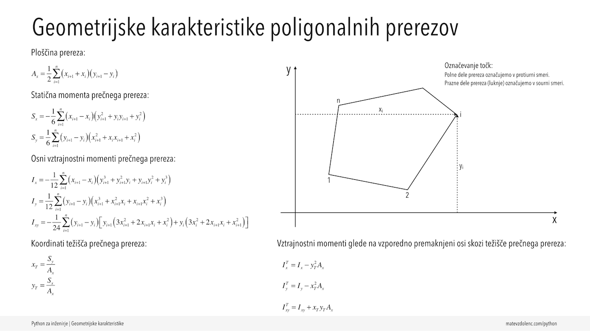
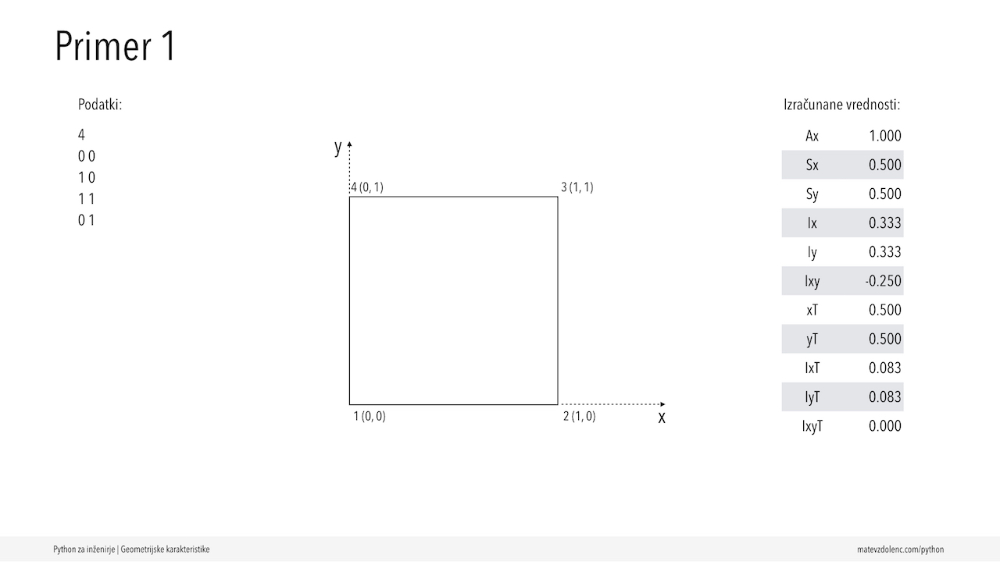
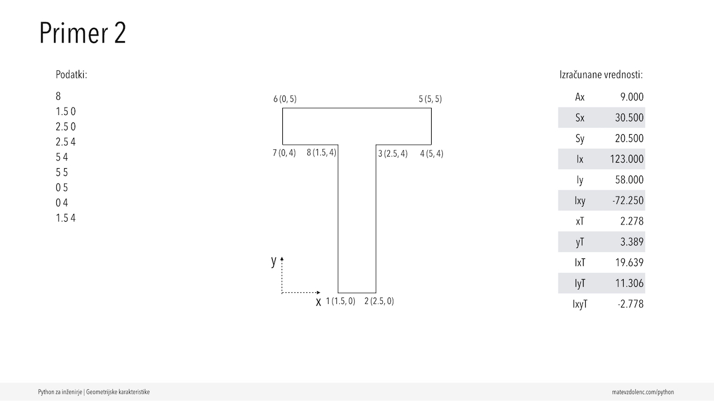
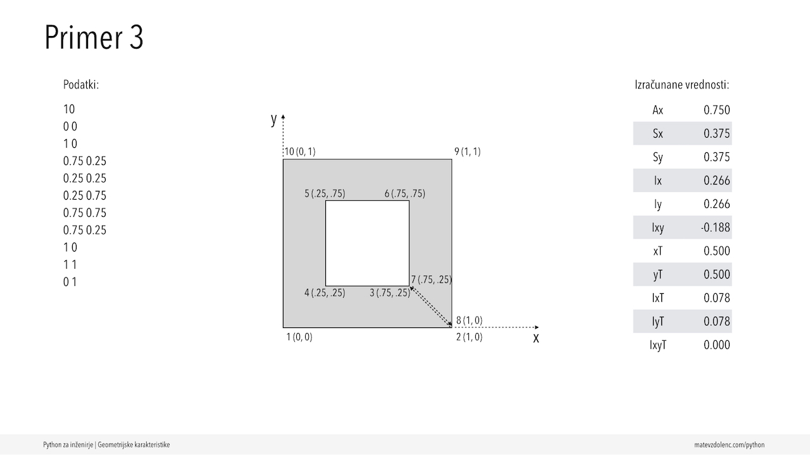







## Povezave
- [Python podatkovni tip "list"](https://docs.python.org/3/library/stdtypes.html?highlight=list#list) 
- [Primeri uporabe seznamov](https://docs.python.org/3/tutorial/introduction.html#lists)

## Formule in primeri podatkov


  
  
  
  


## Izvorna koda

### [geokar.py](https://raw.githubusercontent.com/matevzdolenc/matevzdolenc.github.io/main/static/pzi-video/src/012/geokar.py)



